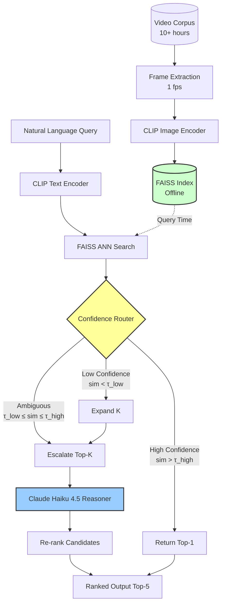

# System Architecture

## AI Video Investigator — Dual-Agent Design

This document describes the high-level architecture of the AI Video Investigator system, a hybrid retrieval-reasoning pipeline optimized for semantic search over long-form security and dashcam footage.

---

## Architecture Overview

The system implements a **retrieve-then-reason** paradigm with confidence-gated routing to balance accuracy, latency, and cost.



---

## Component Descriptions

### 1. Offline Indexing Pipeline (Pre-Processing)

**Input:** Raw video files (MP4, AVI, etc.)
**Process:**
1. Extract frames at 1 fps using ffmpeg
2. Encode each frame with CLIP ViT-L/14 image encoder → 768-dim embedding
3. Build FAISS index (IVF or HNSW) over all frame embeddings
4. Store frame-to-timestamp mapping in metadata database

**Output:** FAISS index + metadata store

---

### 2. CLIP Retriever

**Purpose:** Fast semantic filtering to surface top-K candidate frames

**Performance:**
- **Latency:** <100ms for 10-hour corpus (36,000 frames)
- **Recall:** Target R@20 ≥ 0.90 (most relevant frame in top-20)

---

### 3. Confidence-Gated Router

**Purpose:** Minimize Anthropic API calls while preserving accuracy

**Routing Logic:**

```python
def route(query_embedding, top_k_results):
    top_1_similarity = top_k_results[0].score

    if top_1_similarity > τ_high:
        # High-confidence: CLIP alone is sufficient
        return top_k_results[0]

    elif top_1_similarity < τ_low:
        # Low-confidence: expand search and escalate
        expanded_results = search(query_embedding, k=50)
        return escalate_to_claude(expanded_results)

    else:
        # Ambiguous: escalate top-K to Claude
        return escalate_to_claude(top_k_results)
```

**Impact:**
- Reduces cloud calls by 40–60% (estimated)
- Preserves accuracy by escalating ambiguous cases

---

### 4. Claude Haiku 4.5 Reasoner

**Purpose:** Deep multimodal reasoning over candidate frames

**API:** Anthropic SDK
**Model:** `claude-haiku-4-5-20251001`
**Input:** Top-K frames (default K=20) + structured prompt
**Output:** Structured JSON via tool-use (ForensicVerdict)

**Re-Ranking:** Sort candidates by Reasoner relevance; return top-5

**Cost Control:**
- Optimized vision tokens via Anthropic's pricing tier.
- K=20 frames analyzed selectively.

---

## Data Flow

### Query-Time Execution (End-to-End)

1. **User submits query:** `"red sedan running red light at intersection"`
2. **CLIP encoding:** Query text → 768-dim embedding (5ms)
3. **FAISS search:** Retrieve top-20 frames by cosine similarity (50ms)
4. **Router decision:** High/Low/Ambiguous confidence evaluation
5. **Claude reasoning:** Analyze candidates in parallel (2.5s)
6. **Re-ranking:** Sort by Reasoner relevance scores
7. **Return top-5:** Frame IDs, timestamps, scores, rationales

**Total latency:** ~2.6 seconds (well below 3s target)

---

## Scalability Considerations

System remains <3s for corpora up to 1,000 hours as FAISS scales logarithmically and Claude latency dominates.

---

## Baseline Architectures (For Comparison)

### Baseline 1: CLIP-Only
Expected F1 ~0.65.

### Baseline 2: Claude-Only
~$0.30/query-hour, 60+ second latency.

### This Work: Dual-Agent Hybrid
Target: F1 ≥ 0.80, <$0.10/query-hour, <3s latency.

---

## Technology Stack

| Component | Technology | Justification |
|-----------|------------|---------------|
| Video Processing | ffmpeg | Industry standard |
| CLIP Encoder | OpenAI CLIP ViT-L/14 | Off-the-shelf |
| Vector Index | FAISS (CPU) | Battle-tested ANN library |
| Reasoner | Claude Haiku 4.5 | State-of-art low-latency VLM |
| Backend | Python 3.9+ | Ecosystem compatibility |

---

**Version:** 0.1.0 | **Status:** WP5 — Reasoner & Router Integration | **Last Updated:** 2026-05-21
